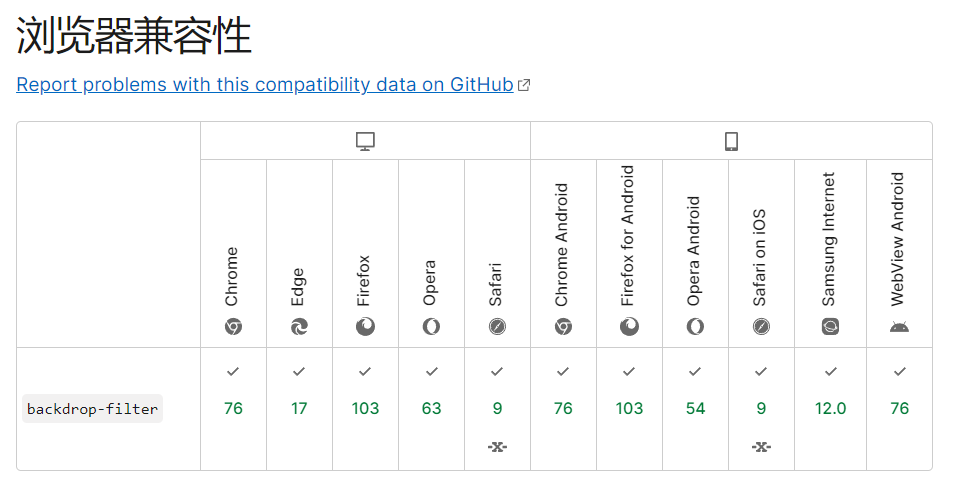

<script setup>
  import FrostedGlass from './example/frosted-glass.vue'
</script>

# 磨砂玻璃效果

## 实现

<FrostedGlass/>

## 分析

利用 backdrop-filter 实现

```css
/* 关键词值 */
backdrop-filter: none;

/* 指向 SVG 滤镜的 URL */
backdrop-filter: url(commonfilters.svg#filter);

/* <filter-function> 滤镜函数值 */
backdrop-filter: blur(2px);
backdrop-filter: brightness(60%);
backdrop-filter: contrast(40%);
backdrop-filter: drop-shadow(4px 4px 10px blue);
backdrop-filter: grayscale(30%);
backdrop-filter: hue-rotate(120deg);
backdrop-filter: invert(70%);
backdrop-filter: opacity(20%);
backdrop-filter: sepia(90%);
backdrop-filter: saturate(80%);

/* 多重滤镜 */
backdrop-filter: url(filters.svg#filter) blur(4px) saturate(150%);

/* 全局值 */
backdrop-filter: inherit;
backdrop-filter: initial;
backdrop-filter: revert;
backdrop-filter: unset;
```

## 兼容性


