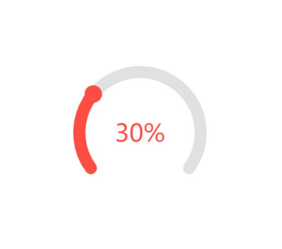

<script setup>
  import CircleProgress from './example/progress/circle-progress.vue'
  import DashboardProgress from './example/progress/dashboard-progress.vue'
</script>

# 实现一个环形进度条

## 示例 1

<CircleProgress />

## 示例 2

<DashboardProgress />

## 示例代码

```html
<canvas id="canvas" width="450px" height="450px"></canvas>
<script>
  function draw(percent, options) {
    // 判断参数
    if (percent < 0 || percent > 100) {
      console.error("percent is not allowed value");
      return;
    }
    if (
      options &&
      Object.prototype.toString.call(options) !== "[object Object]"
    ) {
      console.error("options is not object value");
      return;
    }
    // 默认
    const defaultOptions = {
      size: 200,
      sR: 0.8 * Math.PI, // 绘制开始弧度
      eR: 2.2 * Math.PI, // 绘制结束弧度
      baseColor: "#e1e1e1",
      coverColor: "#fe4d43",
    };
    // options
    const { size, sR, eR, baseColor, coverColor } = options || defaultOptions;
    // 限制开始弧度值
    if (sR < Math.PI / 2 || sR >= (3 / 2) * Math.PI) {
      return;
    }
    // canvas
    let canvas = document.querySelector("#canvas"),
      ctx = canvas.getContext("2d"),
      cWidth = canvas.width,
      cHeight = canvas.height;
    let currentPercent = 0; // 当前比例
    let step = (eR - sR) / 100; // 一个1%对应的弧度大小
    let finalRadian = sR + step * percent; // 终点弧度
    // 首次
    window.requestAnimationFrame(paint);
    // 绘制
    function paint() {
      ctx.clearRect(0, 0, cWidth, cHeight);
      let endRadian = sR + currentPercent * step;
      // 画灰色圆弧
      drawCanvas(cWidth / 2, cHeight / 2, size / 2, sR, eR, baseColor, 20);
      // 画红色圆弧
      drawCanvas(
        cWidth / 2,
        cHeight / 2,
        size / 2,
        sR,
        endRadian,
        coverColor,
        20
      );
      // 画红色圆头
      // 红色圆头其实就是一个圆，关键的是找到其圆心，涉及到三角函数知识，自己画个图一看就明了
      let angle = 2 * Math.PI - endRadian; // 转换成逆时针方向的弧度（三角函数中的）
      xPos = (Math.cos(angle) * size) / 2 + cWidth / 2; // 红色圆 圆心的x坐标
      yPos = (-Math.sin(angle) * size) / 2 + cHeight / 2; // 红色圆 圆心的y坐标
      drawCanvas(xPos, yPos, 2, 0, 2 * Math.PI, coverColor, 25);
      // 数字
      ctx.fillStyle = coverColor;
      ctx.font = "40px PT Sans";
      let textWidth = ctx.measureText(currentPercent + "%").width;
      ctx.fillText(
        currentPercent + "%",
        cWidth / 2 - textWidth / 2,
        cHeight / 2 + 15
      );
      currentPercent++;
      if (endRadian.toFixed(2) < finalRadian.toFixed(2)) {
        window.requestAnimationFrame(paint);
      }
    }
    // 绘制形状
    function drawCanvas(x, y, r, sRadian, eRadian, color, lineWidth) {
      ctx.beginPath();
      ctx.lineCap = "round";
      ctx.strokeStyle = color;
      ctx.lineWidth = lineWidth;
      ctx.arc(x, y, r, sRadian, eRadian, false);
      ctx.stroke();
    }
  }
  draw(30);
</script>
```


