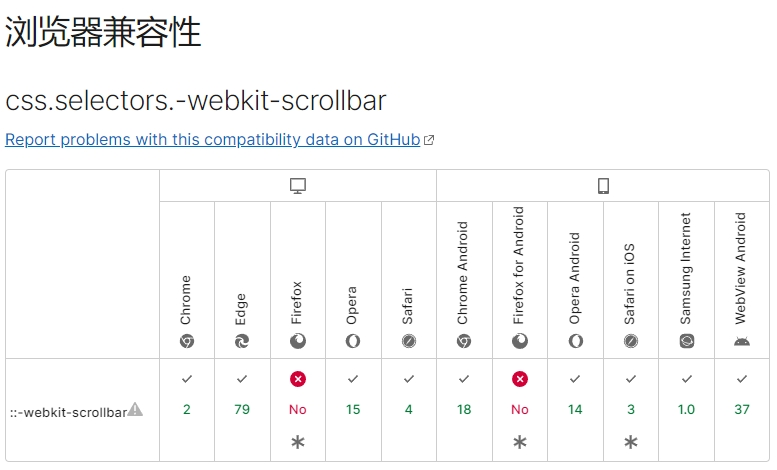

# 改变滚动条样式

##  `::-webkit-scrollbar`
整个滚动条

## `::-webkit-scrollbar-button`
滚动条上的按钮（上下箭头）

## `::-webkit-scrollbar-thumb`
滚动条上的滚动滑块 

##  `::-webkit-scrollbar-track`
滚动条轨道

##  `::-webkit-scrollbar-track-piece`
滚动条没有滑块的轨道部分

##  `::-webkit-scrollbar-corner`
垂直滚动条和水平滚动条时交汇的部分

##  `::-webkit-resizer`
某些元素底角的可拖动调整大小的滑块


## 示例

```css
/* 滚动槽 */
::-webkit-scrollbar {
    width: 6px;
    height: 6px;
}
::-webkit-scrollbar-track {
    border-radius: 3px;
    background: rgba(0,0,0,0.06);
    -webkit-box-shadow: inset 0 0 5px rgba(0,0,0,0.08);
}
/* 滚动条滑块 */
::-webkit-scrollbar-thumb {
    border-radius: 3px;
    background: rgba(0,0,0,0.12);
    -webkit-box-shadow: inset 0 0 10px rgba(0,0,0,0.2);
}

```


