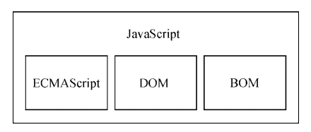

# JavaScript组成

> 包含三个部分：ECMAScript、DOM(文档对象模型)、BOM(浏览器对象模型)
> 
 1. ECMAScript：由ECMA-262定义并提供核心功能
 2. DOM: 提供与网页内容交互的方法和接口
 3. BOM: 提供与浏览器交互的方法和接口



## ECMA-262
> js语言标准规范，定义：语法、类型、语句、关键字、保留字、操作符、全局对象

1. 第1版，标准基本与网景 JavaScript 1.1版本一致
2. 第2版，做了一些编校工作，没有特性更新与删减
3. 第3版，更新了字符串处理、错误定义和数值输出，还增加了正则表达式、控制语句、try/catch异常处理
4. 第4版，做了彻底的修订，包括强类型变量、新的语句和数据结构，类和经典的继承等。最终由于变化太大，被废弃
5. 第5版，优化ES4变化太大，被废弃，基于第3版的3.1版本变成了第5版，增加了JSON对象，增加了严格模式
6. 第6版，俗称ES6,增加了新特性，支持类、模块、迭代器、生成器、箭头函数、期约、反射、代理和性的数据类型等。
7. 第7版，ES7，少量语法层面的增强，如Array.prototype.includes等
8. 第8版，ES8，最重要增加了async/await异步处理函数
9. 第9版，ES9，少量特性更新，异步迭代、正则表达式新特性
10. 第10版，....

## DOM 文档对象模型

DOM是一个应用程序编程接口，用于HTML中使用扩展XML，可以通过DOM创建文档树，控制网页结构与内容

### DOM 级别
  1. DOM level 1 ，主要是映射文档结构
  2. DOM level 2 ，扩展了鼠标及界面事件、范围、遍历DOM节点支持，还支持CSS
     - DOM视图：追踪文档不同视图的接口
     - DOM事件：描述事件和事件处理的接口
     - DOM样式：描述处理CSS的接口
     - DOM遍历和范围：描述遍历和操作DOM树的接口 
  3. DOM level 3 ， 统一加载和保存文档的方法，验证文档的方法，支持xml1.0所有的特性
  4. DOM 4 ， 目前后续版本不使用级别来规范，标准化，增加了 Mutation Events的 Mutation Observers

## BOM 浏览器对象模型

提供了支持访问、操作浏览器的接口

- 弹出浏览器窗口的能力
- 移动、缩放和关闭浏览器的能力
- navigator对象，提供了浏览器详细信息
- location对象，提供了浏览器加载页面的详细信息
- screen对象，提供屏幕分辨率的信息
- performance对象，提供了浏览器内存占用、导航行为、时间统计的详细信息
- cookie支持
- 其他自定义对象，XMLHttpRequest等


> 网页HTML中添加JavaScript需要使用```<script>```标签


