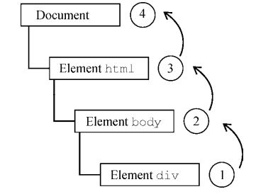
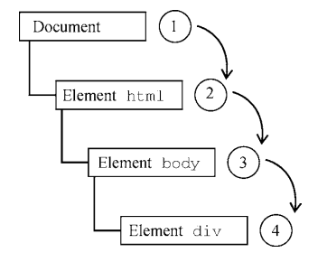
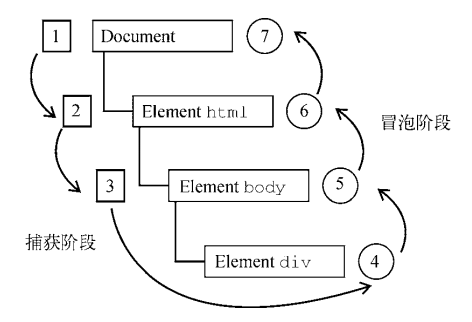

# 事件

## 介绍

JavaScript 与 HTML 的交互是通过事件实现的

## 事件流

1. 事件冒泡，
   
2. 事件捕获
   

### DOM0 events

DOM0 事件，特指 DOM 标准还未规范时定义的事件，一般时个浏览器定义

事件处理程序：
一般使用在标签元素上使用`onclick="eventFunc"`这种或者

```js
const btn = document.getElementByTagName("button");
btn.onclick = function () {
  // TODO
};

// 清除事件
btn.onclick = null;
```

### DOM2 events

DOM2 Events 规范规定事件流分为 3 个阶段：事件捕获、到达目标和事件冒泡。事件捕获最先发生，
为提前拦截事件提供了可能。然后，实际的目标元素接收到事件。最后一个阶段是冒泡，最迟要在这个
阶段响应事件



> 注意 DOM2 Events 规范明确捕获阶段不命中事件目标，但现代浏览器都会在捕获阶段在事件目标上触发事件

事件处理程序：

使用`addEventListener`、`removeEventListener`，添加和移除事件，参数为：事件名、事件处理函数、一个布尔值(true：捕获阶段处理事件，false（默认）：冒泡阶段处理事件)

### DOM3 Events

DOM3 Events 在 DOM2 Events 基础上重新定义了事件，并增加了新的事件类型

DOM3 Events 定义了如下事件类型。

- 用户界面事件（UIEvent）：涉及与 BOM 交互的通用浏览器事件。
- 焦点事件（FocusEvent）：在元素获得和失去焦点时触发。
- 鼠标事件（MouseEvent）：使用鼠标在页面上执行某些操作时触发。
- 滚轮事件（WheelEvent）：使用鼠标滚轮（或类似设备）时触发。
- 输入事件（InputEvent）：向文档中输入文本时触发。
- 键盘事件（KeyboardEvent）：使用键盘在页面上执行某些操作时触发。
- 合成事件（CompositionEvent）：在使用某种 IME（Input Method Editor，输入法编辑器）输入字符时触发。

#### 用户界面事件

- DOMActivate：元素被用户通过鼠标或键盘操作激活时触发（比 click 或 keydown 更通用）。
  这个事件在 DOM3 Events 中已经废弃。因为浏览器实现之间存在差异，所以不要使用它。
- load：在 window 上当页面加载完成后触发，在窗套（`<frameset>`）上当所有窗格（`<frame>`）
  都加载完成后触发，在``元素上当图片加载完成后触发，在`<object>`元素上当相应对象加
  载完成后触发。
- unload：在 window 上当页面完全卸载后触发，在窗套上当所有窗格都卸载完成后触发，在
  `<object>`元素上当相应对象卸载完成后触发。
- abort：在`<object>`元素上当相应对象加载完成前被用户提前终止下载时触发。
- error：在 window 上当 JavaScript 报错时触发，在``元素上当无法加载指定图片时触发，
  在`<object>`元素上当无法加载相应对象时触发，在窗套上当一个或多个窗格无法完成加载时
  触发。
- select：在文本框（`<input>`或 textarea）上当用户选择了一个或多个字符时触发。
- resize：在 window 或窗格上当窗口或窗格被缩放时触发。
- scroll：当用户滚动包含滚动条的元素时在元素上触发。`<body>`元素包含已加载页面的滚动条。

#### 焦点事件

- blur：当元素失去焦点时触发。这个事件不冒泡，所有浏览器都支持。
- DOMFocusIn：当元素获得焦点时触发。这个事件是 focus 的冒泡版。Opera 是唯一支持这个事
  件的主流浏览器。DOM3 Events 废弃了 DOMFocusIn，推荐 focusin。
- DOMFocusOut：当元素失去焦点时触发。这个事件是 blur 的通用版。Opera 是唯一支持这个事
  件的主流浏览器。DOM3 Events 废弃了 DOMFocusOut，推荐 focusout。
- focus：当元素获得焦点时触发。这个事件不冒泡，所有浏览器都支持。
- focusin：当元素获得焦点时触发。这个事件是 focus 的冒泡版。
- focusout：当元素失去焦点时触发。这个事件是 blur 的通用版。

#### 鼠标和滚轮事件

- click：在用户单击鼠标主键（通常是左键）或按键盘回车键时触发。这主要是基于无障碍的考
  虑，让键盘和鼠标都可以触发 onclick 事件处理程序。
- dblclick：在用户双击鼠标主键（通常是左键）时触发。这个事件不是在 DOM2 Events 中定义
  的，但得到了很好的支持，DOM3 Events 将其进行了标准化。
- mousedown：在用户按下任意鼠标键时触发。这个事件不能通过键盘触发。
- mouseenter：在用户把鼠标光标从元素外部移到元素内部时触发。这个事件不冒泡，也不会在
  光标经过后代元素时触发。mouseenter 事件不是在 DOM2 Events 中定义的，而是 DOM3 Events
  中新增的事件。
- mouseleave：在用户把鼠标光标从元素内部移到元素外部时触发。这个事件不冒泡，也不会在
  光标经过后代元素时触发。mouseleave 事件不是在 DOM2 Events 中定义的，而是 DOM3 Events
  中新增的事件。
- mousemove：在鼠标光标在元素上移动时反复触发。这个事件不能通过键盘触发。
- mouseout：在用户把鼠标光标从一个元素移到另一个元素上时触发。移到的元素可以是原始元
  素的外部元素，也可以是原始元素的子元素。这个事件不能通过键盘触发。
- mouseover：在用户把鼠标光标从元素外部移到元素内部时触发。这个事件不能通过键盘触发。
- mouseup：在用户释放鼠标键时触发。这个事件不能通过键盘触发。

#### 键盘与输入事件

- keydown，用户按下键盘上某个键时触发，而且持续按住会重复触发。
- keypress，用户按下键盘上某个键并产生字符时触发，而且持续按住会重复触发。Esc 键也会
  触发这个事件。DOM3 Events 废弃了 keypress 事件，而推荐 textInput 事件。
- keyup，用户释放键盘上某个键时触发。

#### 合成事件

合成事件是 DOM3 Events 中新增的，用于处理通常使用 IME 输入时的复杂输入序列

- compositionstart，在 IME 的文本合成系统打开时触发，表示输入即将开始；
- compositionupdate，在新字符插入输入字段时触发；
- compositionend，在 IME 的文本合成系统关闭时触发，表示恢复正常键盘输入


## 事件优化

使用事件，需要考虑内存与性能问题。例如：

- 最好限制一个页面中事件处理程序的数量，因为它们会占用过多内存，导致页面响应缓慢；
- 利用事件冒泡，事件委托可以解决限制事件处理程序数量的问题；
- 最好在页面卸载之前删除所有事件处理程序。
