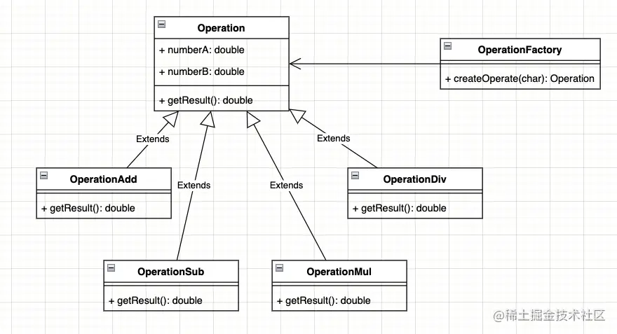

## 一、创建型模式
### 1.1 简单工厂模式

### 1.2 工厂方法模式
工厂方法模式，定义一个用于创建对象的接口，让子类决定实例化哪一个类。工厂方法使一个类的实例化延迟到其子类。

### 1.3 抽象工厂模式
抽象工厂模式，提供一个创建一系列相关或相互依赖对象的接口，而无需指定它们具体的类。

### 1.4 原型模式
原型模式，用原型实例指定创建对象的种类，并且通过拷贝这些原型创建新的对象。

### 1.5 建造者模式
建造者模式，将一个复杂对象的构建与它的表示分离，使得同样的构建过程可以创建不同的表示。

### 1.6 单例模式
单例模式，保证一个类仅有一个实例，并提供一个访问它的全局访问点。

## 二、结构型模式
### 2.1 适配器模式
适配器模式，将一个类的接口转换成客户希望的另外一个接口。Adapter 模式使得原本由于接口不兼容而不能一起工作的那些类可以一起工作。

### 2.2 桥接模式
桥接模式，将抽象部分与它的实现部分分离，使它们都可以独立地变化。

### 2.3 组合模式
组合模式，将对象组合成树形结构以表示“部分-整体”的层次结构。组合模式使得用户对单个对象和组合对象的使用具有一致性。

### 2.4 装饰模式
装饰模式，动态地给一个对象添加一些额外的职责，就增加功能来说，装饰模式比生成子类更为灵活。

### 2.5 外观模式
外观模式，为子系统中的一组接口提供一个一致的界面，此模式定义了一个高层接口，这个接口使得这一子系统更加容易使用。

### 2.6 享元模式
享元模式，运用共享技术有效地支持大量细粒度的对象。

### 2.7 代理模式
代理模式，为其他对象提供一种代理以控制对这个对象的访问。

## 三、行为模式
### 3.1 解释器模式
解释器模式，给定一个语言，定义它的文法的一种表示，并定义一个解释器，这个解释器使用该表示来解释语言中的句子。

### 3.2 模板方法模式
模板方法模式，定义一个操作中的算法的骨架，而将一些步骤延迟到子类中。模板方法使得子类可以不改变一个算法的结构即可重定义该算法的某些特定步骤。

### 3.3 策略模式
场景：商场促销。简单工厂模式虽然也能解决这个问题，但这个模式只是解决对象的创建问题，而且由于工厂本身包括了所有的收费方式，商场是可能经常性地更改打折额度和返利额度，每次维护或扩展收费方式都要改动这个工厂。所以它不是最好的办法。
面对算法的时常变动，应该有更好的办法。
策略模式：它定义了算法家族，分别封装起来，让它们之间可以互相替换，此模式让算法的变化，不会影响到使用算法的客户。

### 3.4 观察者模式
观察者模式定义了一种一对多的依赖关系，让多个观察者对象同时监听某一个主题对象。这个主题对象在状态发生变化时，会通知所有观察者对象，使它们能够自动更新自己。

### 3.5 状态模式
状态模式，当一个对象的内在状态改变时允许改变其行为，这个对象看起来像是改变了其类。

### 3.6 备忘录模式
备忘录：在不破坏封装性的前提下，捕获一个对象的内部状态，并在该对象之外保存这个状态。这样以后就可将该对象恢复到原先保存的状态。

### 3.7 迭代器模式
迭代器模式，提供一种方法顺序访问一个聚合对象中各个元素，而又不暴露该对象的内部表示。

### 3.8 命令模式
命令模式，将一个请求封装为一个对象，从而使你可用不同的请求对客户进行参数化：对请求排队或记录请求日志，以 及支持可撤销的操作。

### 3.9 责任链模式
责任链模式，使多个对象都有机会处理请求，从而避免请求的发送者和接收者之间的耦合关系。将这个对象连成一条链，并沿着这条链传递该请求，直到有一个对象处理它为止。

### 3.10 中介者模式
中介者模式，用一个中介对象来封装一系列的对象交互。中介者使各对象不需要显式地相互引用，从而使其耦合松散，而且可以独立地改变它们之间的交互。

### 3.11 访问者模式（附）
访问者模式，表示一个作用于某对象结构中的各元素的操作。它使你可以在不改变各元素的类的前提下定义作用于这些元素的新操作。

