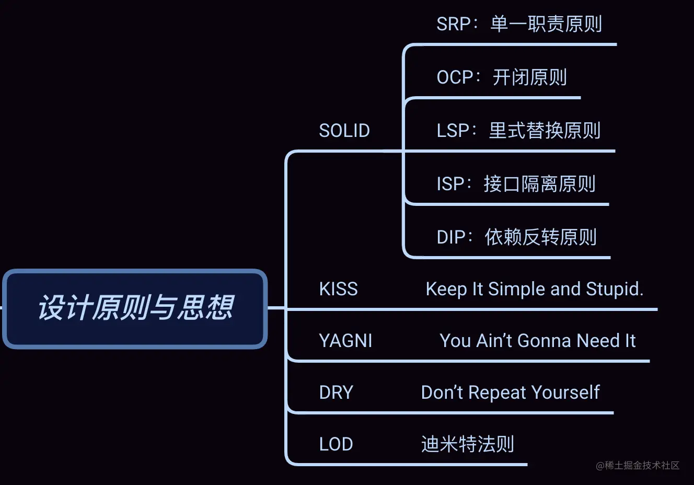

# 设计原则与思想

## SOLID 原则
SOLID 原则并非单纯的 1 个原则，而是由 5 个设计原则组成的，它们分别是：单一职责原则、开闭原则、里式替换原则、接口隔离原则和依赖反转原则，依次对应 SOLID 中的 S、O、L、I、D 这 5 个英文字母。我们来分别看一下。

SRP-单一职责原则

全称：Single Responsibility Principle

定义： A class or module should have a single responsibility.==>一个类或者模块只负责完成一个职责（或者功能）。

理解：每一个类，应该要有明确的定义，不要设计大而全的类，要设计粒度小、功能单一的类。

作用：避免将不相关的代码耦合在一起，提高了类或者模块的内聚性。

## OCP-开闭原则

全称：Open Closed Principle

定义： software entities (modules, classes, functions, etc.) should be open for extension , but closed for modification. ==> 软件实体（模块、类、方法等）应该“对扩展开放、对修改关闭”。

描述：添加一个新的功能应该是，在已有代码基础上扩展代码（新增模块、类、方法等），而非修改已有代码（修改模块、类、方法等）。

作用： 增加了类的可扩展性。

## LSP-里式替换原则

全称：Liskov Substitution Principle

定义：Functions that use pointers of references to base classes must be able to use objects of derived classes without knowing it.==>子类对象能够替换程序中父类对象出现的任何地方，并且保证原来程序的逻辑行为不变及正确性不被破坏。

## LSP-接口隔离原则

全称：Interface Segregation Principle

定义： Clients should not be forced to depend upon interfaces that they do not use. ==>   客户端不应该被强迫依赖它不需要的接口。(其中的“客户端”，可以理解为接口的调用者或者使用者)。

描述：使用TyepScript开发的小伙伴可能对Interface更熟悉一些，但是把接口单纯的理解就是Interface也比较片面，我们说的接口可以包括这三个方面

一组 API 接口集合

单个 API 接口或函数

OOP 中的接口概念

这一原则和单一职责原则有点类似，只不过它更侧重于接口。

如果把“接口”理解为一组接口集合，可以是某个类库的接口等。如果部分接口只被部分调用者使用，我们就需要将这部分接口隔离出来，单独给这部分调用者使用，而不强迫其他调用者也依赖这部分不会被用到的接口。

如果把“接口”理解为单个 API 接口或函数，部分调用者只需要函数中的部分功能，那我们就需要把函数拆分成粒度更细的多个函数，让调用者只依赖它需要的那个细粒度函数。

如果把“接口”理解为 OOP 中的接口，也可以理解为面向对象编程语言中的接口语法。那接口的设计要尽量单一，不要让接口的实现类和调用者，依赖不需要的接口函数。

## DIP-依赖反转原则

全称：Dependency Inversion Principle

定义：高层模块不要依赖低层模块。高层模块和低层模块应该通过抽象来互相依赖。除此之外，抽象不要依赖具体实现细节，具体实现细节依赖抽象。大白话就是面向接口编程，依赖于抽象而不依赖于具体

理解：基于接口而非实现编程

## KISS原则
关于KISS原则英文描述有好几个版本

Keep It Simple and Stupid.

Keep It Short and Simple.

Keep It Simple and Straightforward.

这几个描述的都差不多，大体意思就是： 尽量保持简单。这是一个“万金油”的设计原则，它不光可以用在软件开发上，更加广泛的产品设计，系统设计例如冰箱，洗衣机都用到了这个原则。当时看乔布斯砖的时候，你会觉得他一直在践行这个原则。

那么我们在开发中应该怎么践行这个原则呢

尽量不要使用同事可能不懂的技术来实现代码

不要重复造轮子，要善于使用已经有的工具类库

不要过度优化，不要过度使用一些奇技淫巧

## YAGNI原则
YAGNI 原则的英文全称是：You Ain’t Gonna Need It。直译就是：你不会需要它。这条原则也算是万金油了。当用在软件开发中的时候，它的意思是：不要去设计当前用不到的功能；不要去编写当前用不到的代码。实际上，这条原则的核心思想就是：不要做过度设计。

DRY原则

它的英文描述为：Don’t Repeat Yourself。中文直译为：不要重复自己。将它应用在编程中，可以理解为：不要写重复的代码。

看似简单，实际上我们工作中不自觉的写了大量重复的代码，比如

实现逻辑重复

功能语义重复

代码执行重复

## 迪米特法则
单从这个名字上来看，我们完全猜不出这个原则讲的是什么。不过，它还有另外一个更加达意的名字，叫作最小知识原则，英文翻译为：The Least Knowledge Principle。

通俗的讲就是： 不该有直接依赖关系的类之间，不要有依赖；有依赖关系的类之间，尽量只依赖必要的接口（也就是定义中的“有限知识”）。

迪米特法则是实现高内聚，松耦合的法宝。那么什么是高内聚和松耦合呢？

所谓高内聚，就是指相近的功能应该放到同一个类中，不相近的功能不要放到同一个类中。相近的功能往往会被同时修改，放到同一个类中，修改会比较集中，代码容易维护。

所谓松耦合是说，在代码中，类与类之间的依赖关系简单清晰。即使两个类有依赖关系，一个类的代码改动不会或者很少导致依赖类的代码改动。

不该有直接依赖关系的类之间，不要有依赖；有依赖关系的类之间，尽量只依赖必要的接口。迪米特法则是希望减少类之间的耦合，让类越独立越好。每个类都应该少了解系统的其他部分。一旦发生变化，需要了解这一变化的类就会比较少。
