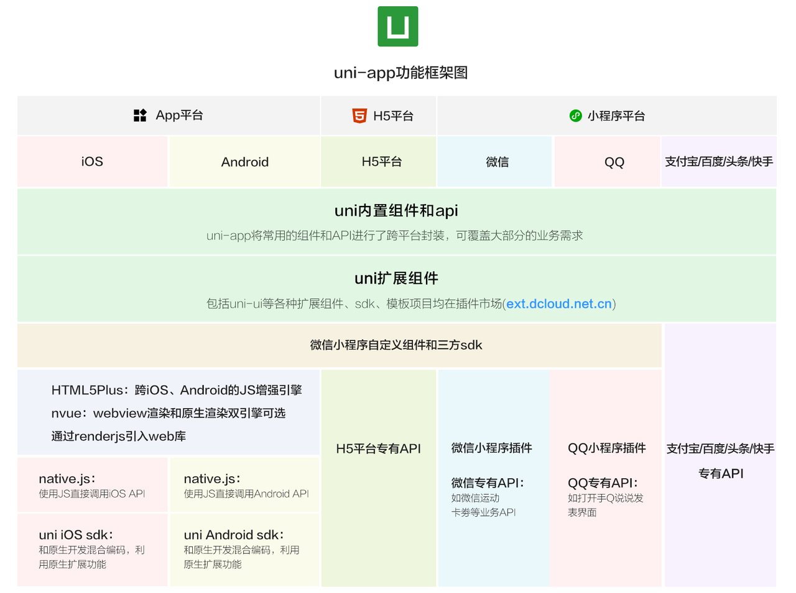
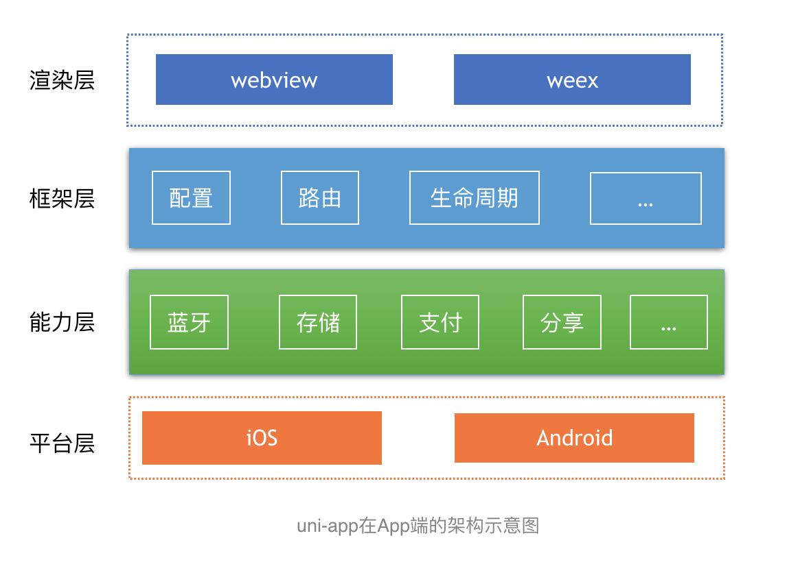

# uniapp

## 简介
是一个使用 Vue.js 开发所有前端应用的框架，开发者编写一套代码，可发布到iOS、Android、Web（响应式）、以及各种小程序（微信/支付宝/百度/头条/飞书/QQ/快手/钉钉/淘宝）、快应用等多个平台。

## 官方文档

https://uniapp.dcloud.net.cn/

## 开发

执行以下脚本

```shell
# 安装vue/cli脚手架
npm install -g @vue/cli

# 创建工程
vue create -p dcloudio/uni-preset-vue my-project

# 安装依赖
npm install

# 运行 & 构建
npm run dev:%PLATFORM%
npm run build:%PLATFORM%
```

模板项目存放于 Github，由于国内网络环境问题，可能下载失败。针对此问题可以尝试如下措施：
- 更换网络重试，比如使用 4g 网络
- 在设备或路由器的网络设置中增加 DNS（如：8.8.8.8）
- 在设备中增加固定的 hosts（如：140.82.113.4 github.com）


## 架构


