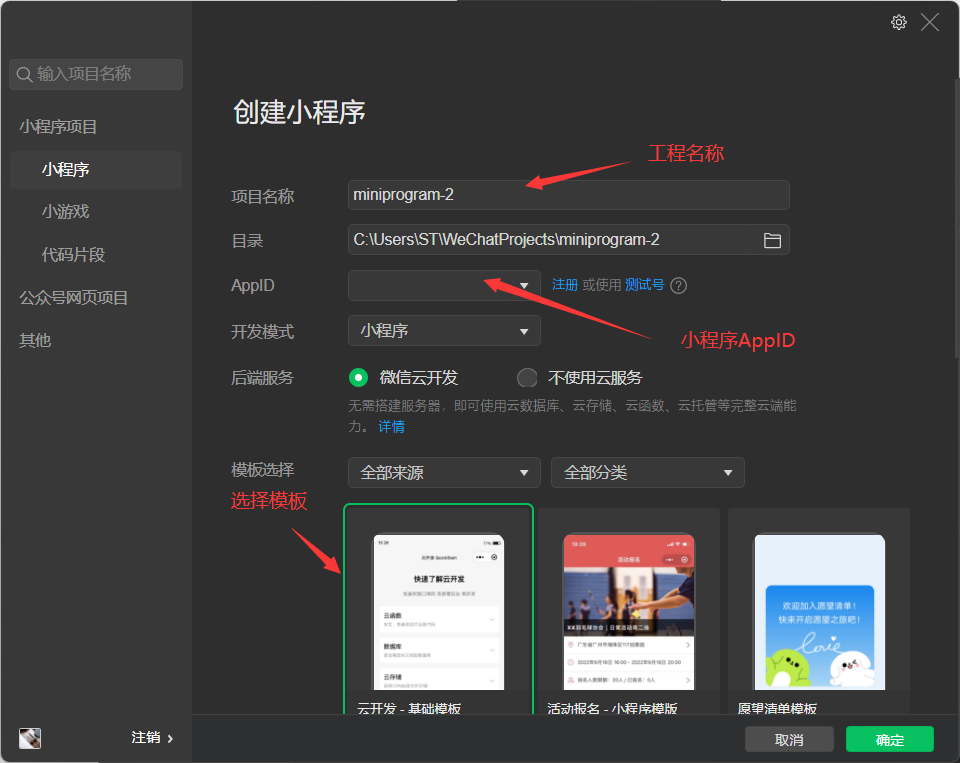
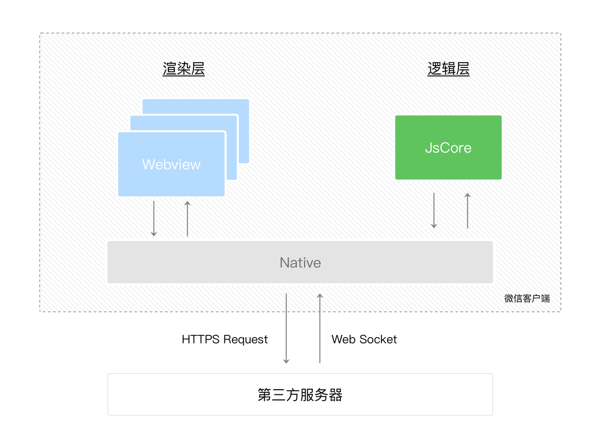
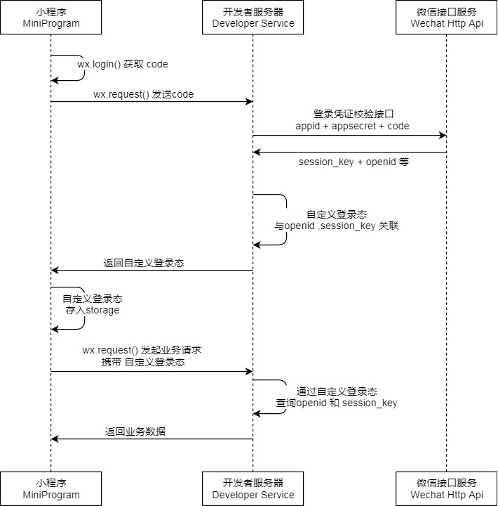

# 微信小程序

## 简介

小程序是一种全新的连接用户与服务的方式，它可以在微信内被便捷地获取和传播，同时具有出色的使用体验。
基于微信提供的webview，小程序成为移动 Web 的一个重要入口

## 开发
1. 开通开发者账号，微信公众平台
2. 安装小程序开发者工具
3. 使用微信登录开发者账号
4. 创建小程序工程项目

    注：微信小程序AppID由微信公众平台注册小程序获得

    

5. 开始开发

## 发布

1. 使用微信开发者工具上传代码
2. 或使用小程序CI工具 miniprogram-ci   需要node环境
3. 上传后的代码在微信公众平台提交审核发布，测试可设置代码为体验版

## 文档

[微信小程序开发框架文档](https://developers.weixin.qq.com/miniprogram/dev/reference/)

注意事项
1. 小程序发起请求，默认会忽略局域网ip网段，请求可通过
  1. 请求的其他ip或域名地址需要在小程序后台配置白名单
  2. 请求URL必须为https的公网地址
2. 上传代码，同一个CI机器人上传会默认覆盖之前的版本

## 框架架构

## 对接微信账号登录

## 开发工具

[微信开发者工具下载地址](https://developers.weixin.qq.com/miniprogram/dev/devtools/download.html)
