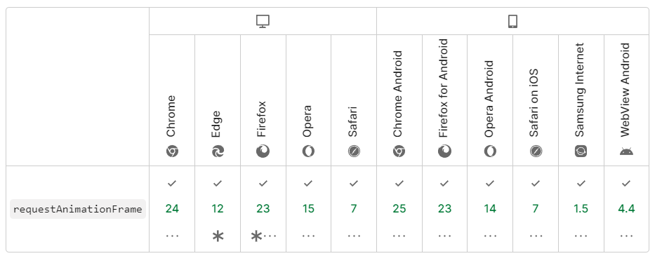
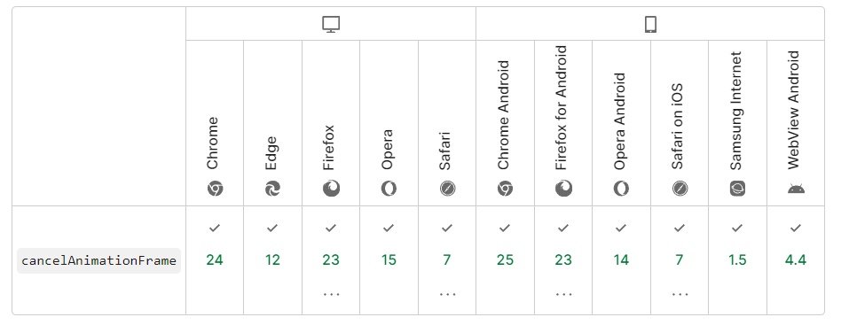

# requestAnimationFrame 帧动画

## 介绍

`requestAnimationFrame` 浏览器在下次重绘之前调用指定的回调函数更新动画。该方法需要传入一个回调函数作为参数，该回调函数会在浏览器下一次重绘之前执行。

回调函数执行次数通常是每秒 60 次，但在大多数遵循 W3C 建议的浏览器中，回调函数执行次数通常与浏览器屏幕刷新次数相匹配。

```js
// 动画执行函数
function callback() {
  // TODO ...
}
// 执行
const animationId = window.requestAnimationFrame(callback)
// 取消
window.cancelAnimationFrame(animationId)
```

## 浏览器兼容性


