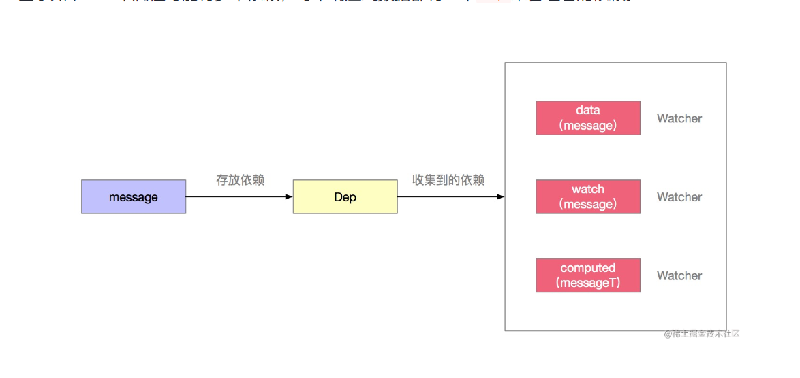

# Observer 观察者

vue2 观察者模式，利用`Object.defineProperty(target, key, options)`修改对象`target`属性的访问器属性实现。`get` 与 `set`


## 核心代码

```js
export function defineReactive (
  obj: Object,
  key: string,
  val: any,
  customSetter?: ?Function,
  shallow?: boolean
) {

  /**
   * 创建订阅器
   */
  const dep = new Dep()

  /**
   * 获取obj原生property
   */
  const property = Object.getOwnPropertyDescriptor(obj, key)
  if (property && property.configurable === false) {
    return
  }

  // cater for pre-defined getter/setters
  const getter = property && property.get
  const setter = property && property.set
  if ((!getter || setter) && arguments.length === 2) {
    val = obj[key]
  }

  let childOb = !shallow && observe(val)

  /**
   * 修改obj， key属性的访问器属性
   */
  Object.defineProperty(obj, key, {
    // 可枚举
    enumerable: true,
    // 可配置
    configurable: true,
    // get 对象属性访问 obj[key]
    get: function reactiveGetter () {
      const value = getter ? getter.call(obj) : val
      if (Dep.target) {
        // 收集依赖
        dep.depend()
        
        if (childOb) {
          childOb.dep.depend()
          if (Array.isArray(value)) {
            dependArray(value)
          }
        }
      }
      return value
    },
    // set 对象属性值设置 obj[key] = val
    set: function reactiveSetter (newVal) {
      const value = getter ? getter.call(obj) : val
      /* eslint-disable no-self-compare */
      if (newVal === value || (newVal !== newVal && value !== value)) {
        return
      }
      /* eslint-enable no-self-compare */
      if (process.env.NODE_ENV !== 'production' && customSetter) {
        customSetter()
      }
      // #7981: for accessor properties without setter
      if (getter && !setter) return
      if (setter) {
        setter.call(obj, newVal)
      } else {
        val = newVal
      }
      childOb = !shallow && observe(newVal)

      /**
       * 值改变，发布者发布
       */
      dep.notify()
    }
  })
}
```


## 观察者与Dep、Watcher关系

每一个data属性都有一个`Dep`发布者，管理多个依赖订阅者`Wathcer`

