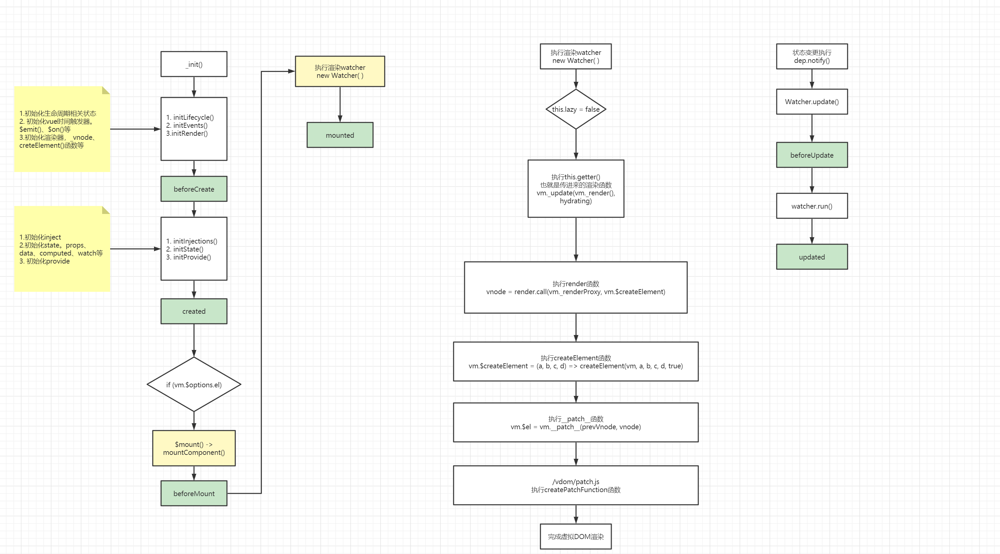

# vue2

## 核心执行流程



## Vue 实例

```js
import { initMixin } from './init'
import { stateMixin } from './state'
import { renderMixin } from './render'
import { eventsMixin } from './events'
import { lifecycleMixin } from './lifecycle'
import { warn } from '../util/index'

function Vue (options) {
  if (process.env.NODE_ENV !== 'production' &&
    !(this instanceof Vue)
  ) {
    warn('Vue is a constructor and should be called with the `new` keyword')
  }
  this._init(options)
}

/**
 * 混入初始化
 */
initMixin(Vue)
/**
 * 混入状态state相关
 * $props
 * $data
 * $set
 * $delete
 * $watch
 */
stateMixin(Vue)
/**
 * 混入事件相关
 * $on
 * $emit
 * $once
 * $off
 */
eventsMixin(Vue)
/**
 * 混入生命周期相关
 * _update
 * $forceUpdate
 * $destroy
 */
lifecycleMixin(Vue)
/**
 * 混入渲染相关
 * $nextTick
 * _render
 */
renderMixin(Vue)

export default Vue

```

```js
export function initMixin (Vue: Class<Component>) {
  Vue.prototype._init = function (options?: Object) {
    const vm: Component = this
    
    // ...
    
    /**
     * 初始化生命周期相关内容，如：
     * $parent
     * $root
     * $children
     * $refs
     * 
     * _isMounted
     * _isDestroyed
     * _isBeginDestroyed
     */
    initLifecycle(vm)
    /**
     * 初始化事件属性，如：
     * _events
     */
    initEvents(vm)
    /**
     * 初始化渲染器, 如：
     * _vdom 定义虚拟dom
     * $slots 定义插槽
     * $createElement 定义虚拟dom构建函数
     */
    initRender(vm)
    /**
     * beforeCreate 生命周期钩子
     */
    callHook(vm, 'beforeCreate')
    /**
     * 初始化inject
     */
    initInjections(vm) // resolve injections before data/props
    /**
     * 初始化状态state
     * initProps 初始化props
     * initMethods 初始化methods,主要为methods bind vue this
     * initData 初始化data, 将data定义响应式
     * initComputed 初始化computed
     * initWatch 初始化监听器
     */
    initState(vm)
    /**
     * 初始化注入器provide
     */
    initProvide(vm) // resolve provide after data/props
    /**
     * created 生命周期钩子
     */
    callHook(vm, 'created')

    // ...

    /**
     * 判断mount元素$el
     */
    if (vm.$options.el) {
      /**
       * 执行mountComponent()
       * 创建渲染Watcher，new Watcher()
       * 并执行渲染函数，得到虚拟dom，vm._update(vm._render(), hydrating)
       * 最后执行__patch__函数，完成dom更新渲染，vm.__patch__(prevVnode, vnode)
       */
      vm.$mount(vm.$options.el)
    }
  }
}
```