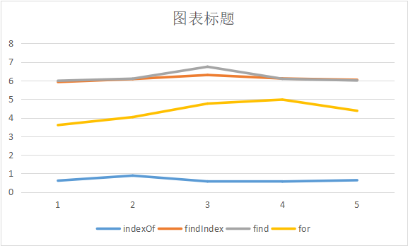
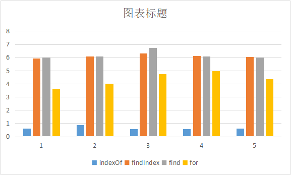

# Array的indexOf、find与findIndex在时间上的区别

## 分析表格

| indexOf           | findIndex         | find              | for               |
| ----------------- | ----------------- | ----------------- | ----------------- |
| 0.611083984375 ms | 5.9228515625 ms   | 5.990966796875 ms | 3.604248046875 ms |
| 0.8828125 ms      | 6.0849609375 ms   | 6.10302734375 ms  | 4.0341796875 ms   |
| 0.56982421875 ms  | 6.30126953125 ms  | 6.74609375 ms     | 4.760986328125 ms |
| 0.56494140625 ms  | 6.11181640625 ms  | 6.096923828125 ms | 4.97412109375 ms  |
| 0.634033203125 ms | 6.040771484375 ms | 6.00390625 ms     | 4.3740234375 ms   |

## 结果趋势图





## 结论

> indexOf的执行速度最快
>
> for循环此次之
>
> find、findIndex 执行效率最慢，效率大致相同

## 测试代码

```js
let arr = [];
// 生成一个100万级的随机整数, 并在里面插入一个目标值
for (let i = 0; i <= 1000000; i++) {
  if (i === 678900) {
    arr.push("target");
    continue;
  }
  const number = parseInt(Math.random() * 1000000);
  arr.push(number);
}
console.log(arr);
// indexOf
console.log("----------------------indexOf:");
console.time();
console.log(arr.indexOf("target"));
console.timeEnd();
//findIndex
console.log("----------------------findIndex:");
console.time();
console.log(arr.findIndex((it) => it === "target"));
console.timeEnd();
//find
console.log("----------------------find:");
console.time();
console.log(arr.find((it) => it === "target"));
console.timeEnd();
//for
console.log("----------------------for:");
console.time();
let index = -1
for(let i = 0; i< arr.length; i++) {
  if(arr[i] === 'target') {
    index = i
    break
  }
}
console.log(index);
console.timeEnd();


```
