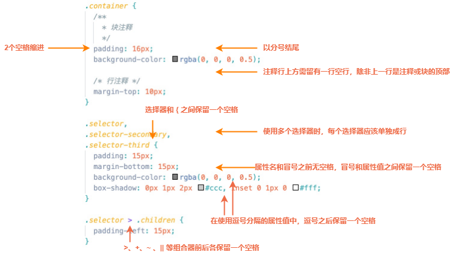

# CSS 规约

## 一、CSS

## 1.1 css 风格指南

1. ### 【推荐】编码风格

参考：https://github.com/alibaba/f2e-spec/blob/main/docs/coding/2.css-style-guide.md



## 1.2 缩进

1. ### 【强制】使用 2 个空格缩进

统一使用 2 个空格缩进，不要使用 4 个空格或 tab 缩进

## 1.3 css 选择器

1. ### 【强制】选择器的命名

   - class、id 使用英文小写
   - 类名命名需要语义化
   - 命名使用英文，禁止使用特殊字符

【推荐】 语义化命名方式

```md
.wrap{} //外层容器
.mod-box{} //模块容器
.btn-start{} //开始
.btn-download-ios{} //ios 下载
.btn-download-andriod{} //安卓下载
.btn-head-nav1{} //头部导航链接 1
.btn-news-more{} //更多新闻
.btn-play{} //播放视频
.btn-ico{} //按钮 ico
.btn-lottery{} //开始抽奖
.side-nav{} //侧栏导航
.side-nav-btn1{} //侧栏导航-链接 1
.btn-more{} //更多
```

正例：

```css
.heavy {
  font-weight: 800;
}

.important {
  color: red;
}
反例： .fw-800 {
  font-weight: 800;
}

.red {
  color: red;
}
```

2. ###  【推荐】避免使用 标签 选择器

标签选择器容易污染全局

3. ### 【推荐】尽量不使用 id 选择器

id 会带来过高的选择器优先级，使得后续很难进行样式覆盖（继而引发使用 `!important` 覆盖样式的恶性循环）。

4. ### 【推荐】控制选择器的长度，每个组合选择器内的条目尽量不超过 3 个

选择器过长会有性能问题

```css
/* 推荐 */
#username input {
}
.comment .avatar {
}

/* 不推荐 */
.page .header .login #username input {
}
.comment div * {
}
```

## 1.4 css 属性

1. ### 【推荐】属性声明的顺序。

相关联的属性声明最好写成一组，并按如下顺序排序：

   1. 定位：如 `position、left、right、top、bottom、z-index`
   2. 盒模型：如 `display、float、width、height、margin、padding、border`
   3. 文字排版：如 `font、color、line-height、text-align`
   4. 外观：如 `background`
   5. 其他属性

  >「定位」和「盒模型」放在最前面，是因为它们决定了元素的布局、位置和尺寸。「定位」排在「盒模型」之前，是由于「定位」属性可以让元素脱离正常文本流，从而使「盒模型」属性失效。除了「定位」和「盒模型」，其他属性都只在元素内部起作用，不会对前两类属性的结果产生影响，因此放在后面。

示例：

```css
.declaration-order {
  /* 定位 */
  position: absolute;
  top: 0;
  right: 0;
  bottom: 0;
  left: 0;
  z-index: 100;

  /* 盒模型 */
  display: block;
  float: right;
  width: 100px;
  height: 100px;
  border: 1px solid #e5e5e5;

  /* 排版 */
  font: normal 13px "Helvetica Neue", sans-serif;
  line-height: 1.5;
  color: #333;
  text-align: center;

  /* 外观 */
  background-color: #f5f5f5;

  /* 其他 */
  opacity: 1;
}
```

1. ### 【推荐】不要使用 `!important` 重写样式。

`!important`会使样式变得难以控制

3. ### 【推荐】尽量使用缩写属性

正例：

```css
 {
  border-top: 0;
  padding: 0 1em 2em;
}
```

反例：

```css
 {
  border-top-style: none;
  font-family: palatino, georgia, serif;
  font-size: 100%;
  line-height: 1.6;
  padding-bottom: 2em;
  padding-left: 1em;
  padding-right: 1em;
  padding-top: 0;
}
```

4. ### 【强制】每个选择器及属性独占一行

正例：

```css
button {
  width: 100px;
  height: 50px;
  color: #fff;
  background: #00a0e9;
}
```

反例：

```css
button {
  width: 100px;
  height: 50px;
  color: #fff;
  background: #00a0e9;
}
```

5. ### 【推荐】省略 0 后面的单位

正例：

```css
div {
  padding-bottom: 0;
  margin: 0;
}
```

反例：

```css
div {
  padding-bottom: 0px;
  margin: 0em;
}
```
